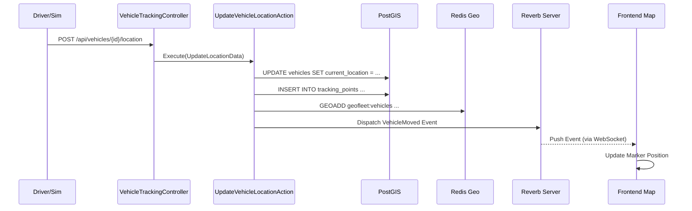

# GeoFleet

https://github.com/user-attachments/assets/6cdc29d5-a36b-4c73-b329-a0e0143ecd39


[](https://php.net)
[](https://laravel.com)
[](https://www.postgresql.org/)
[](https://postgis.net/)
[](https://redis.io/)
[](https://laravel.com/docs/reverb)

**Real-time Logistics Tracking System & Geospatial API.**

GeoFleet is an advanced vehicle tracking platform designed to handle high-velocity geospatial data. It enables real-time visualization of fleet movements, historical path tracking, and efficient proximity searches using industry-standard GIS technologies.

---

## 🚀 Key Features

*   🌍 **Advanced Geospatial Data**
    Leverages **PostgreSQL + PostGIS** to store precise vehicle locations (`GEOGRAPHY` type). Supports complex spatial queries like "Find vehicles within 5km radius" (`ST_DWithin`) and accurate distance calculations on the earth's spheroid (`ST_Distance`).

*   📡 **Real-time Updates (WebSockets)**
    Uses **Laravel Reverb** (WebSocket Server) to broadcast vehicle movements instantly to the frontend map. No polling required - data is pushed as soon as it changes.

*   ⚡ **High-Performance Caching**
    Implements **Redis Geo** to index vehicle positions in memory. This allows for lightning-fast spatial lookups and reduces load on the primary database during high-frequency location updates.

*   🏗️ **Modular Monolith**
    Architected using **Domain-Driven Design (DDD)** principles. The codebase is organized into a dedicated `Logistics` domain (`app/Domains/Logistics`) with segregated DTOs, Actions, and Models for better maintainability and scalability.

*   🗺️ **Live Visualization**
    Includes a reactive frontend dashboard built with **Leaflet.js** and **Laravel Echo**, visualizing vehicle movements on an interactive map in real-time.

---

## 🛠 Tech Stack

| Component | Technology | Description |
| :--- | :--- | :--- |
| **Framework** |  | Core application framework. |
| **Language** |  | Modern PHP with robust typing. |
| **Database** |  | Spatial database for `GEOGRAPHY` data types. |
| **Real-time** |  | First-party Laravel WebSocket server. |
| **Cache** |  | Redis Geo for in-memory spatial indexing. |
| **Frontend** |  | Open-source JavaScript library for mobile-friendly interactive maps. |
| **Testing** |  | Elegant testing framework. |

---

## 📖 Architecture Flow

The following diagram illustrates how a vehicle location update propagates through the system.



---

## 🔌 API Reference

### 1. Update Vehicle Location
Updates coordinates for a specific vehicle and logs the history.

- **Endpoint:** `POST /api/vehicles/{vehicle}/location`
- **Content-Type:** `application/json`

#### Request
```json
{
  "latitude": 45.0355,
  "longitude": 38.9753,
  "speed": 65.5,
  "heading": 180.0
}
```

### 2. Find Nearby Vehicles
Finds all vehicles within a specified radius using PostGIS `ST_DWithin`.

- **Endpoint:** `GET /api/vehicles/nearby`
- **Query Params:** `latitude`, `longitude`, `radius` (in meters)

#### Response
```json
[
  {
    "id": 1,
    "name": "Volvo FH16",
    "distance": 150.5  // Distance in meters from search point
  }
]
```

---

## ⚡ Quick Start & Demo

You can easily run the entire project, including the simulation, using Laravel Sail (Docker).

1.  **Clone the repository**
    ```bash
    git clone https://github.com/web-inwall/geo-fleet.git
    cd geo-fleet
    ```

2.  **Start the environment**
    ```bash
    cp .env.example .env
    ./vendor/bin/sail up -d
    ```

3.  **Setup Database & Seed**
    This creates 20 simulated vehicles around Krasnodar.
    ```bash
    ./vendor/bin/sail artisan migrate:fresh --seed
    ```

4.  **Start Reverb Server**
    Required for real-time updates.
    ```bash
    ./vendor/bin/sail artisan reverb:start
    ```

5.  **Run the Simulation**
    Open `http://localhost/map` in your browser, then run this command to start moving vehicles:
    ```bash
    ./vendor/bin/sail artisan fleet:simulate
    ```

---

## 🧪 Testing

The project includes a comprehensive test suite covering Unit (Domain Logic) and Feature (API & DB Integration) tests.

```bash
# Run all tests
./vendor/bin/sail test
```
